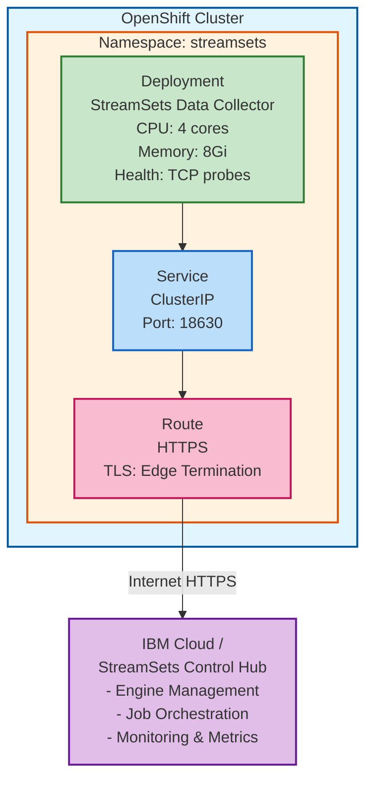

# StreamSets Engines on OpenShift

Automated deployment scripts for StreamSets Data Collector engines on OpenShift/Kubernetes clusters, with integration to IBM Cloud StreamSets service.

## Overview

This repository provides production-ready scripts to deploy and manage StreamSets Data Collector engines on OpenShift. The engines connect to IBM Cloud StreamSets (or StreamSets Control Hub) for centralized management and job execution.

## Features

- ✅ **Automated Deployment**: One-command deployment to OpenShift
- ✅ **Health Monitoring**: TCP-based health probes for reliability
- ✅ **Secure Configuration**: Credentials stored in Kubernetes Secrets
- ✅ **HTTPS Support**: OpenShift Route with TLS termination
- ✅ **Resource Management**: Configurable CPU and memory limits

## Prerequisites

- OpenShift CLI (`oc`) installed and configured
- Access to an OpenShift cluster with appropriate permissions
- StreamSets account with API credentials from IBM Cloud or StreamSets Control Hub

## Quick Start

### 1. Login to OpenShift

```bash
oc login <your-openshift-cluster-url> -u <username>
```

### 2. Configure Environment Variables (Optional)

The scripts use default values, but you can override them:

```bash
export SSET_API_KEY="your-api-key"
export SSET_PROJECT_ID="your-project-id"
export SSET_ENVIRONMENT_ID="your-environment-id"
export SSET_BASE_URL="https://api.ca-tor.dai.cloud.ibm.com"
export STREAMSETS_NAMESPACE="streamsets"
export STREAMSETS_CPU="4"
export STREAMSETS_MEMORY="8Gi"
```

### 3. Deploy StreamSets Engine

```bash
./deploy-streamsets-engine.sh
```

The script will:
- Create a dedicated namespace
- Store credentials securely in Kubernetes Secrets
- Deploy StreamSets Data Collector with specified resources
- Create a Service and Route for access
- Wait for the deployment to be ready

## Files

### `deploy-streamsets-engine.sh`

Main deployment script that creates all necessary Kubernetes resources:
- Namespace
- Secret (for StreamSets credentials)
- Deployment (with health probes and resource limits)
- Service (ClusterIP)
- Route (HTTPS with edge termination)

**Usage:**
```bash
./deploy-streamsets-engine.sh
```

### `STREAMSETS_DEPLOYMENT_README.md`

Detailed documentation covering:
- Configuration options
- Troubleshooting steps
- Monitoring commands
- Integration with Cloud Pak for Data
- Security considerations

## Configuration

### Environment Variables

| Variable | Default | Description |
|----------|---------|-------------|
| `SSET_API_KEY` | (embedded) | StreamSets API key from IBM Cloud |
| `SSET_PROJECT_ID` | (embedded) | StreamSets project ID |
| `SSET_ENVIRONMENT_ID` | (embedded) | StreamSets environment ID |
| `SSET_BASE_URL` | `https://api.ca-tor.dai.cloud.ibm.com` | StreamSets API base URL |
| `STREAMSETS_NAMESPACE` | `streamsets` | OpenShift namespace |
| `STREAMSETS_IMAGE` | `icr.io/streamsets/datacollector:JDK17_7.4.0` | Container image |
| `STREAMSETS_CPU` | `4` | CPU cores |
| `STREAMSETS_MEMORY` | `8Gi` | Memory allocation |
| `STREAMSETS_REPLICAS` | `1` | Number of replicas |

### Customizing Resources

To deploy with different resources:

```bash
export STREAMSETS_CPU="2"
export STREAMSETS_MEMORY="4Gi"
./deploy-streamsets-engine.sh
```

## Accessing the Engine

After deployment, get the external URL:

```bash
oc get route streamsets-datacollector -n streamsets -o jsonpath='{.spec.host}'
```

Access via: `https://<route-host>`

## Monitoring

### Check Pod Status

```bash
oc get pods -n streamsets
```

### View Logs

```bash
oc logs -f deployment/streamsets-datacollector -n streamsets
```

### Check Deployment

```bash
oc get deployment streamsets-datacollector -n streamsets
```

### View Service and Route

```bash
oc get svc,route -n streamsets
```

## Troubleshooting

### Pod Not Starting

Check pod events:
```bash
oc describe pod <pod-name> -n streamsets
```

### Image Pull Issues

Verify image exists and check pull secrets:
```bash
oc get events -n streamsets | grep -i pull
```

### Connection Issues

Test the route:
```bash
ROUTE_URL=$(oc get route streamsets-datacollector -n streamsets -o jsonpath='{.spec.host}')
curl -k https://${ROUTE_URL}
```

### Engine Not Showing Online

1. Check pod logs for connection errors
2. Verify API credentials are correct
3. Ensure network connectivity to StreamSets Control Hub
4. Check if firewall rules allow outbound HTTPS

## Scaling

To scale the number of engine replicas:

```bash
oc scale deployment streamsets-datacollector --replicas=3 -n streamsets
```

## Cleanup

### Remove Deployment

```bash
oc delete all -l app=streamsets-datacollector -n streamsets
oc delete secret streamsets-credentials -n streamsets
```

### Remove Namespace

```bash
oc delete namespace streamsets
```

### Clean Up Offline Engines

Manually through StreamSets UI:
1. Navigate to Execution → Engines
2. Filter by Status = Offline
3. Select and delete offline engines

## Architecture



## Security Considerations

1. **Credentials**: Stored in Kubernetes Secrets (base64 encoded)
2. **Network**: HTTPS with TLS termination at Route level
3. **RBAC**: Uses default service account (consider creating dedicated SA)
4. **Image**: Uses official StreamSets image from IBM Container Registry

## Best Practices

1. **Use dedicated service account** with minimal permissions
2. **Implement network policies** to restrict traffic
3. **Enable resource quotas** to prevent resource exhaustion
4. **Regular updates** of StreamSets Data Collector image
5. **Monitor engine health** through StreamSets Control Hub
6. **Backup configurations** before making changes

## Integration with Cloud Pak for Data

This deployment can be integrated with IBM Cloud Pak for Data:

1. Ensure both are in the same cluster or have network connectivity
2. Configure StreamSets to connect to CPD services
3. Use CPD's storage classes if needed:
   - Block storage: `ocs-storagecluster-ceph-rbd`
   - File storage: `ocs-storagecluster-cephfs`

## Contributing

Contributions are welcome! Please:
1. Fork the repository
2. Create a feature branch
3. Make your changes
4. Test thoroughly
5. Submit a pull request

## License

[Specify your license here]

## Support

For issues related to:
- **StreamSets**: [StreamSets Documentation](https://docs.streamsets.com/)
- **OpenShift**: Check cluster logs and events
- **IBM Cloud**: Contact IBM Cloud support

## Version History

- **v1.0.0** (2026-05-08)
  - Initial release
  - Automated deployment script
  - TCP health probes
  - Comprehensive documentation

## Authors

- Wilson Shamim

## Acknowledgments

- StreamSets for the Data Collector platform
- IBM Cloud for StreamSets service integration
- OpenShift community for deployment best practices
